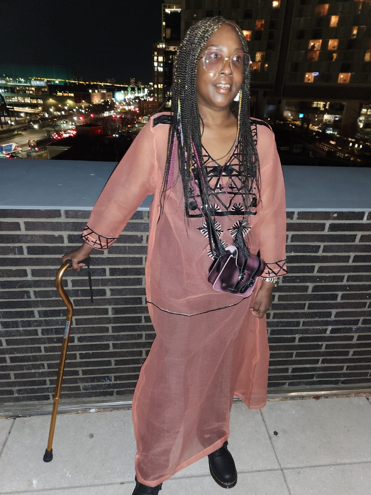

# Adekemi Sijuwade-Ukadike

## Creative Technologist • Artist Leader • Digital Journalism Systems • Builder of Accessible Knowledge and Sensing Systems

Observation is the beginning of knowledge. Tools matter because they shape who gets to observe and participate.

---

## About

Adekemi (Kemi) Sijuwade-Ukadike is a Nigerian, Jamaican, and American creative technologist and artist whose work explores observation, accessibility, and signal interpretation across environmental, technological, and cultural systems.

Her work sits at the intersection of media infrastructure, environmental sensing, creative technology, and community learning.

Earlier in her career, she helped shape early digital journalism infrastructure during the formative years of online publishing. While living in Nigeria she built and directed online newsrooms, designing digital journalism systems that supported emerging internet-based publishing environments.

While living in Nigeria she endured a severe case of drug-resistant malaria which triggered a life-altering neurological illness that developed into <a href="https://www.gbs-cidp.org/guillain-barre/">Guillain-Barré syndrome</a> and later <a href="https://www.gbs-cidp.org/cidp/">chronic inflammatory demyelinating polyneuropathy (CIDP)</a>. This experience reshaped her relationship with technology and deepened her commitment to designing accessible systems that expand participation and observation.

Accessibility is treated not as a feature but as a design principle in her work. Her projects explore how technology can extend human perception through visual, auditory, tactile, and environmental signals.

She has worked across journalism, art, creative technology, and education, supporting artists, building experimental media systems, and developing learning environments where curiosity, observation, and technology intersect.

---

## Flagship Initiatives

### Omoluabi

Omoluabi is an experimental journalism system exploring ethical knowledge infrastructure, signal detection, editorial transparency, and accessible information systems.

The project investigates how small, accessible computing systems can support journalists, researchers, and community observers in gathering signals from the world — environmental, social, and informational — and interpreting them collaboratively.

<!--

Figure — Omoluabi signal journalism system.
-->

---

### Earth Sensors Lab

Earth Sensors Lab is a youth-centered creative technology initiative where gardens become living laboratories for environmental sensing, observation, and collaborative learning.

Students and educators build instruments, place sensors in soil and air, and interpret environmental signals through creative and scientific exploration.

<!--

Figure — Earth Sensors Lab garden observation environment.
-->

---

### Earth Sensors Lab — Sensor System Architecture

<!--

Figure — Earth Sensors Lab environmental sensing system architecture.
-->

---

### Audio Telescope / Signal Instrument

<!--

Figure — Signal instrument used to listen for environmental or cosmic signals.
-->

---

## Areas of Exploration

### Omoluabi
Experimental journalism systems and ethical knowledge infrastructures.

### Environmental Observation
Environmental sensing systems that allow students and communities to observe ecological signals.

### Youth Creative Technology Education
Learning environments where young people build instruments, explore signals, and interpret data through creative practice.

### Accessible Technology
Designing tools and interfaces that expand participation across bodies, contexts, and sensory experiences.

### Wearable and Jewelry-Based Technology
Explorations in projection mapping jewelry, responsive materials, and wearable artifacts that translate environmental signals into tactile or visual forms.

### Soft Robotics Exploration
Early research into responsive materials and soft robotic systems that interact with environments and signals.

---

## Background

Adekemi (Kemi) Sijuwade-Ukadike studied at New York University and later completed graduate work in creative technology at NYU's Interactive Telecommunications Program (ITP).

Across her career she has worked at the intersection of journalism, technology, art, and education, contributing to digital media infrastructure, supporting artists, and building experimental systems that explore how humans observe and interpret the world.

---

## Current Curiosities

- Interstellar objects and signal interpretation
- Environmental sensing networks
- Accessible instrumentation
- Experimental journalism systems
- Garden laboratories and youth learning environments
- Creative technology as a tool for observation

---

## Personal Interests

Writing • Cooking • Jewelry making • Gardening

---

## Copyright

All diagrams, illustrations, and visual systems on this page are original works by **Adekemi Sijuwade-Ukadike**.

© 2026 Adekemi Sijuwade-Ukadike  
All rights reserved.

These materials may not be reproduced, remixed, or redistributed without permission.
