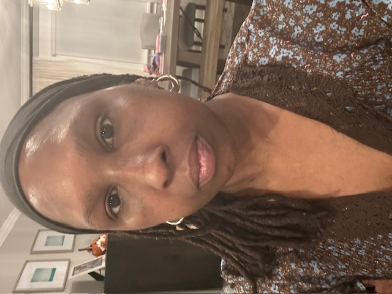
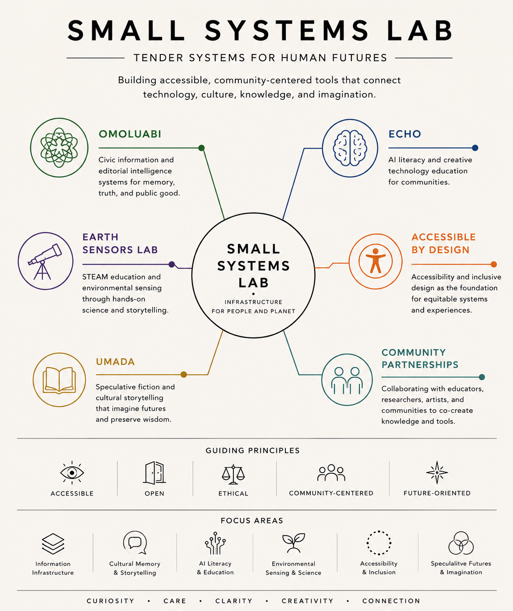

<div align="center">



<sub><em>Adekemi (Kemi) Sijuwade-Ukadike — working between New York City and Lagos.</em></sub>

# Adekemi&nbsp;&middot;&nbsp;Kemi&nbsp;Sijuwade-Ukadike

**Artist&nbsp;&middot;&nbsp;Journalist&nbsp;&middot;&nbsp;Creative Technologist&nbsp;&middot;&nbsp;Educator&nbsp;&middot;&nbsp;Accessibility Advocate**

*Tender systems for human futures.*

</div>

---

I work at the intersection of accessibility, civic information, AI literacy, environmental observation, cultural memory, and speculative storytelling — through research, design, technology, and public-interest inquiry.

My practice draws from journalism, disability advocacy, artist support, emerging technology, and worldbuilding. Through software, education, writing, and creative work, I investigate how systems shape the way people learn, communicate, remember, and imagine futures.

---

## Why this work

I helped build early digital journalism infrastructure during the formative years of online publishing — including online newsrooms I built and directed while living in Nigeria.

While in Nigeria, a severe case of drug-resistant malaria triggered a neurological illness that became Guillain-Barré syndrome and, later, chronic inflammatory demyelinating polyneuropathy (CIDP). That experience reshaped my relationship with technology and deepened a commitment to designing systems that widen who gets to participate and observe.

Accessibility became a design principle rather than a feature — a question of how tools can extend human perception through visual, auditory, tactile, and environmental signals. Small Systems Lab grew out of that through-line, and Omoluabi is its lead: infrastructure built so that the person who notices something keeps control of how it is held and shared.

→ More on this in [**Why Omoluabi**](./WHY-OMOLUABI.md).

---

## Small Systems Lab

Small Systems Lab (SSL) is my independent research and creative practice — a small ecosystem of projects, in formation. It builds accessible, community-centered tools that connect technology, culture, knowledge, and imagination.

<div align="center">
  
  <br>
  <sub><em>The Small Systems Lab ecosystem and its six branches.</em></sub>
</div>

### Small Systems Lab Method

Small Systems Lab builds tender systems through **operations of care**, **rule-based intelligence**, **ancient geometry**, **accessibility**, and **public knowledge**.

SSL asks operational questions before technical ones: who is served, what is collected, what is refused, what consent exists, what risk is created, what must be withheld, what can return to the community, and who has authority to override the machine.

The lab treats intelligence as governance rather than magic. AI may assist, classify, translate, summarize, or detect patterns, but the rules must be visible and human judgment remains central.

Ancient geometry acts as interface logic:

- **Circle** — consent, return, review, recurrence.
- **Triangle** — witness, source, context.
- **Grid** — archive, taxonomy, navigation, civic order.
- **Spiral** — memory, time, learning, revision.
- **Golden ratio** — calm proportion and readable hierarchy.
- **Threshold** — the moment between observe, verify, withhold, and publish.

Accessibility is the architecture of the lab: keyboard-first, screen-reader-readable, captioned, translated, high-contrast, low-bandwidth, and designed for people working in compromised environments.

The ecosystem holds six branches:

- **Omoluabi** — Civic information and editorial intelligence systems for memory, truth, and context.
- **Echo** — AI literacy and creative technology education for communities.
- **Earth Sensors Lab** — STEAM education and environmental sensing through hands-on science and storytelling.
- **Accessible by Design** — Accessibility and inclusive design as the foundation for equitable systems and experiences.
- **Umada** — Speculative fiction and cultural storytelling that imagine futures and preserve wisdom.
- **Community Partnerships** — Collaborating with educators, researchers, artists, and communities to co-create knowledge and tools.

**Guiding principles:** Accessible &middot; Open &middot; Ethical &middot; Community-centered &middot; Future-oriented

---

## Areas of Concentration

- **Accessibility** — Accessible design, disability culture, inclusive technologies, and equitable participation.
- **Civic Information** — Editorial intelligence, information systems, documentation, archives, and public-interest technology.
- **AI Literacy** — Learning tools, critical engagement, creative experimentation, and public education.
- **Environmental Observation** — Sensors, environmental data, astronomy, Earth observation, and scientific storytelling.
- **Cultural Memory** — Archives, oral histories, language preservation, historical documentation, and collective knowledge.
- **Speculative Storytelling** — Worldbuilding, future histories, science fiction, visual narratives, and emerging technologies.

---

## Featured Projects

### Omoluabi

*Editorial intelligence &middot; Cultural memory &middot; Civic knowledge*

Editorial intelligence and civic information infrastructure — provenance, translation, accessibility, and cultural memory.

**The device:** Observe &middot; Verify &middot; Translate &middot; Preserve &middot; Share

Omoluabi works from a principle of **sovereignty over observation**: the person who noticed something controls how it is held, when it moves, what form it takes, and who benefits. It is the infrastructure that keeps the interval open for consent, context, and care — on terms set by the observer, not the system.

<div align="center">
  
  <br>
  <sub><em>The Omoluabi device — a portable, open-source field recorder for documenting signals with provenance, care, and consent. Observe &middot; Contextualize &middot; Preserve &middot; Share.</em></sub>
</div>

<div align="center">
  
  <br>
  <sub><em>Omoluabi as a portable device and companion web engine — editorial intelligence, cultural memory, civic knowledge.</em></sub>
</div>

```
Human observed   ·   Machine suggested   ·   Context missing   ·   Consent unclear
Protected uncertainty   ·   Unsafe to publish   ·   Ready for review   ·   Withheld
```
<sub>Omoluabi's evidence states — the vocabulary the system uses to hold what is observed.</sub>

**Live site:** https://ukadike.github.io/omoluabi/
Repository: https://github.com/ukadike/omoluabi

### Earth Sensors Lab

Environmental observation, STEAM education, sensor-based learning, astronomy, and scientific storytelling — gardens as living laboratories for sensing and collaborative interpretation.

**Live site:** https://ukadike.github.io/Earth-Sensors-Lab/
Repository: https://github.com/ukadike/Earth-Sensors-Lab

### Echo

AI literacy, learning systems, public engagement, and creative technology education.

**Live site:** https://ukadike.github.io/Echo/
Repository: https://github.com/ukadike/Echo

### Accessible by Design

Accessibility-first tools, inclusive design methods, and disability-centered technology. Includes an open-source WCAG 2.2+ auditing toolkit for websites, p5.js sketches, and PDFs, alongside the original Accessible by Design workshop guide.

Repository: https://github.com/ukadike/accessible-by-design-prototyping

### Umada

Speculative fiction, future histories, cultural memory, and worldbuilding.

<div align="center">
  
  <br>
  <sub><em>Umada — a speculative-noir set on South Africa's Southern Cape. A Cape Agulhas Research Foundation (C.A.R.F.) researcher tends a wounded soldier at the edge of the sea.</em></sub>
</div>

**Live site:** https://ukadike.github.io/Umada/
Repository: https://github.com/ukadike/Umada

---

## Selected Experience

**Head of Artist Initiatives &amp; Inclusion** — Eyebeam &middot; 2020–2024
Led artist support programs, accessibility initiatives, fellowship development, and community engagement for a leading art and technology organization. The role was created to reflect this leadership scope.

**Digital Accessibility Fellow** — Lincoln Center for the Performing Arts &middot; 2019–2020
Developed accessibility strategies, resources, and practices for digital and cultural programming.

**Fellow and Mentor** — Processing Foundation &middot; 2021–2023
Created accessibility-focused curriculum and supported artists and technologists working with creative coding.

**Digital Media &amp; Editorial Leadership**
The New York Times Digital &middot; Dow Jones &middot; PBS/WNET &middot; Microsoft MSN &middot; American Express Publishing &middot; CBS Digital &middot; Newsday &middot; Silverbird Group

---

## Education

**New York University** — MPS, Interactive Telecommunications Program (ITP), Tisch School of the Arts

**New York University** — BA, Journalism and Psychology

---

## Fellowships, Residencies &amp; Awards

- Processing Foundation Fellow
- Lincoln Center Accessibility Fellow
- Eyebeam leadership team
- Artist mentorship, accessibility, and public-interest technology initiatives

---

## Contact

- **GitHub** — [github.com/ukadike](https://github.com/ukadike)
- **Instagram** — [@kemi.systems](https://instagram.com/kemi.systems)
- **Email** — kemiuka@gmail.com

<div align="center">

<sub>Curiosity &middot; Care &middot; Clarity &middot; Creativity &middot; Connection</sub>

</div>